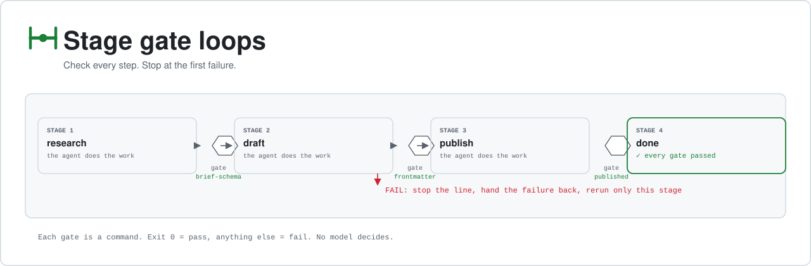
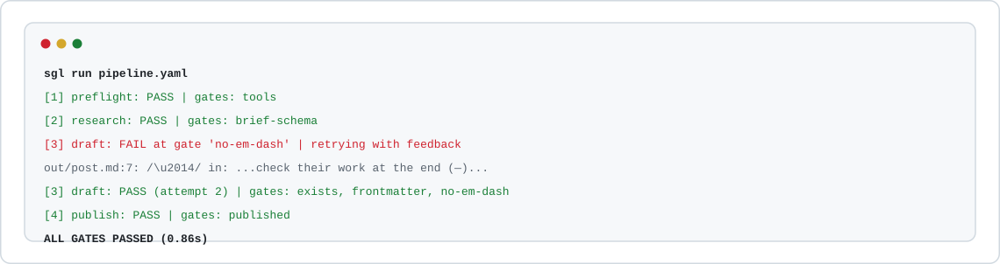
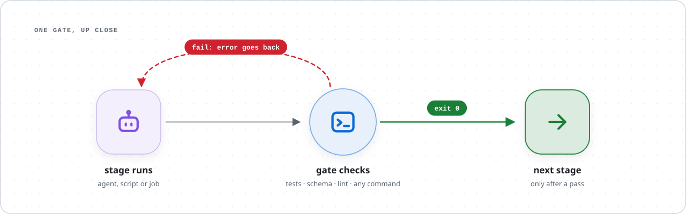
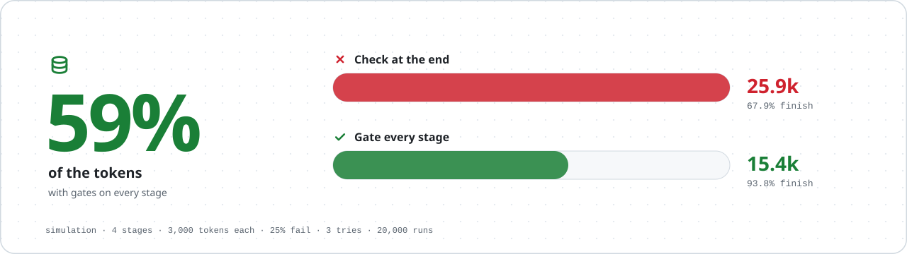
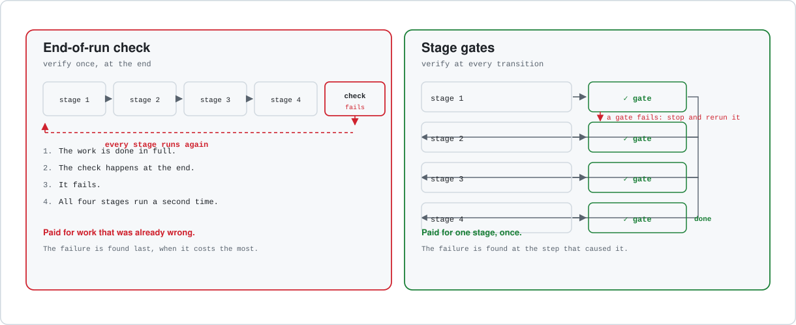

<picture>
  <source media="(prefers-color-scheme: dark)" srcset="assets/hero-dark.svg">
  
</picture>

# stage gate loops

**Every stage of an agent's work ends at a gate. The gate passes, the next stage runs. The gate fails, the line stops.**

[](https://github.com/heyytars/stage-gate-loops/actions/workflows/ci.yml)
[](LICENSE)
[](pyproject.toml)
[](action.yml)

`sgl` is a small runner for that pattern. A gate is any command: exit `0` means pass, anything else stops the run. No model grades the work, so there is nothing to argue with. A schema either validates or it doesn't. Tests either pass or they don't.

It works with any agent: Claude Code, Codex, your own scripts, or plain cron. PyYAML is the only dependency.

## Try it in a minute

```bash
pip install git+https://github.com/heyytars/stage-gate-loops
git clone https://github.com/heyytars/stage-gate-loops
cd stage-gate-loops/examples/blog-publish && sgl run pipeline.yaml
```

<picture>
  <source media="(prefers-color-scheme: dark)" srcset="assets/terminal-dark.svg">
  
</picture>

The draft broke one rule. The gate caught it at stage 3, the exact failing line went back to the agent, and only stage 3 ran again. Research did not repeat, and publish never saw a bad draft.

The examples use offline stub agents, so they run free and give the same result every time. Point them at a real model with `AGENT_CMD="claude -p" sgl run pipeline.yaml`.

## How it works

<picture>
  <source media="(prefers-color-scheme: dark)" srcset="assets/how-it-works-dark.svg">
  
</picture>

Each stage runs its command, then its gates in order. When a gate fails:

1. **The line stops.** Nothing downstream runs.
2. **The failure goes back.** If the stage allows retries, it runs again with the gate's output in `$SGL_FEEDBACK`, so the agent fixes the thing that broke and nothing else.
3. **The run ends where it broke.** Retries exhausted means exit code 1 and a log of exactly what failed. Fix it, then `sgl run pipeline.yaml --resume` carries on from that stage. Earlier stages do not repeat.

New here? **[How it works, in plain words](docs/how-it-works.md)** explains it with no jargon at all.

## A pipeline

```yaml
name: blog-publish
stages:
  - name: preflight          # can this run work at all?
    gates:
      - run: sgl gate preflight --cmd python3 --env API_TOKEN

  - name: draft
    run: python3 agent.py draft
    retries: 2               # on fail, rerun this stage with $SGL_FEEDBACK set
    gates:
      - name: frontmatter
        run: sgl gate frontmatter out/post.md --require title,date
      - name: no-em-dash
        run: sgl gate no-pattern out/post.md -p "\u2014"
      - name: tests
        run: pytest -q       # any command is a gate
```

Every step is logged as JSON lines in `.sgl/runs/`.

## Commands

| | |
|---|---|
| `sgl run pipeline.yaml` | Run it. Exit 0 means every gate passed, 1 means it stopped |
| `--resume` | Skip the stages that passed in the last stopped run |
| `--from <stage>` | Start at a stage |
| `--gates-only` | Check gates only, skip stage commands |
| `--json` | Machine-readable result |
| `sgl validate pipeline.yaml` | Check the file without running anything |
| `sgl gate <name> ...` | Run a built-in gate on its own |
| `sgl hook claude-code pipeline.yaml` | Claude Code `Stop` hook |

## Built-in gates

Standard library only, so a gate cannot break because a package moved underneath it.

| Gate | Checks |
|---|---|
| `preflight --cmd X --env Y --url Z` | Tools on PATH, env vars set (values are never printed), URLs reachable |
| `schema file.json --schema s.json` | JSON matches a schema: type, required, enum, pattern, min/max, items |
| `frontmatter file.md --require a,b` | Markdown frontmatter has the keys, and they are not empty |
| `no-pattern file -p REGEX` | A banned pattern is absent: em dashes, `TODO`, `print(`, filler phrases |
| `words file.md --min N --max M` | Length is within bounds |
| `exists file --min-bytes N` | The output is really there and is not empty |
| `cap --ledger f --key k --max N` | At most N side effects per day (posts, emails, deploys) |

Your own gates are just commands: `pytest`, `tsc --noEmit`, `ruff check`, `gitleaks detect`, `curl -fsS https://staging/health`, or a ten-line script.

## Does it save anything?

<picture>
  <source media="(prefers-color-scheme: dark)" srcset="assets/benchmark-dark.svg">
  
</picture>

That is a **model of the control flow**, not a measurement of a model: four stages, 3,000 tokens per stage run, a 25% chance a stage fails on an attempt, 3 attempts, 20,000 seeded trials. It shows what gates do on their own, because a failure costs one stage instead of the whole run. At a 10% failure rate the saving shrinks to 24%. **The more often a stage breaks, the more gates are worth.** Change the numbers to match your own loop:

```bash
python bench/bench.py sim --costs 3000,3000,3000,3000 --fail 0.25
python bench/bench.py real examples/blog-publish/pipeline.yaml --runs 10   # needs a logged-in claude CLI
```

Real-model numbers are not published yet. Run it and send yours as an issue. The [bench README](bench/README.md) says what each mode proves, and what it does not.

## Two ways to verify a loop

<picture>
  <source media="(prefers-color-scheme: dark)" srcset="assets/two-ways-dark.svg">
  
</picture>

## Claude Code

Block Claude from finishing while a gate fails. Claude gets the exact failure and keeps working:

```json
{
  "hooks": {
    "Stop": [{ "hooks": [{ "type": "command", "command": "sgl hook claude-code .sgl.yaml" }] }]
  }
}
```

The hook runs the pipeline with `--gates-only` against the working tree. On a fail it returns `{"decision": "block", "reason": "<gate output>"}`. Claude Code limits consecutive continuations, so a gate that can never pass cannot trap a session, and a broken pipeline file never blocks either. See [`adapters/claude-code`](adapters/claude-code).

## GitHub Action

```yaml
- uses: heyytars/stage-gate-loops@main
  with:
    pipeline: .sgl.yaml
    gates-only: true    # gate a PR an agent opened
```

The job fails at the first failed gate, and the job summary shows which stage stopped and why. See [`adapters/github-action`](adapters/github-action).

## Examples

| | Shows |
|---|---|
| [`blog-publish`](examples/blog-publish) | Content loop: schema, frontmatter and style gates, retry with feedback |
| [`code-pr`](examples/code-pr) | Code loop: a failing test goes back to the agent, which fixes it |
| [`cron-report`](examples/cron-report) | Scheduled job: preflight, a schema stop on bad upstream data (`BREAK=1`), and a daily cap before delivery |

## Where gates do not apply

Gates check the **shape** of the work: format, schema, tests, types, length, rules, caps. They cannot tell you whether an essay is persuasive or a design is right. That stays with a reviewer, human or model. The point is that by the time review happens, every failure a machine can catch has already been caught.

Good gates come from the real failures you have seen. A gate that passes everything is decoration, and a gate that is too strict stalls the loop. Start with the defect your agent produces most often, and gate that.

## Security

Gates print things, and that output travels to logs, to the agent, and to CI summaries. `sgl` redacts secrets on the way out, keeps logs owner-only, kills a timed-out gate's whole process tree, and locks the daily cap. The trust model is one line: **a pipeline file is code, so treat it like a Makefile.** See [SECURITY.md](SECURITY.md).

## Background

The pattern is not new. It is the Toyota andon cord (anyone can stop the line), test-driven development (the check exists before the work), and CI (a red build blocks the merge), applied to agent loops, which mostly still verify at the end with the same kind of model that did the work.

Read the essay: [Stage Gate Loops: Why Agent Verification Has to Move From the End to Every Transition](https://gauravsingh.net/posts/stage-gate-loops/).

## License

MIT
